# Bitácora de diseño · Unidad 5: Sistemas de partículas

**Actividad 02 · Encargo de diseño:** *una estructura que se convierte en lenguaje*
**Curso:** Simulación (2026-20) · **Cliente:** Centro de Eventos Fórum UPB
**Charla:** *"Relevo generacional: la ventaja que nadie está aprovechando"*

| | |
|---|---|
| **Estudiante** | `[Tu nombre]` |
| **Repositorio** | `[enlace al repo]` |
| **Presentación web (GitHub Pages)** | `[enlace]` |
| **Última actualización** | `[fecha]` |

> **Pregunta central de la unidad:** ¿cómo puede una estructura de elementos relacionados y en movimiento convertirse en un lenguaje visual capaz de construir el significado de un discurso?

---

## Índice

1. [El encargo](#1-el-encargo)
2. [Insumos del cliente](#2-insumos-del-cliente)
3. [Referentes](#3-referentes)
4. [Concepto](#4-concepto)
5. [Gramática visual](#5-gramática-visual)
6. [Del guion al sistema: escena por escena](#6-del-guion-al-sistema-escena-por-escena)
7. [Cumplimiento de la regla de diseño](#7-cumplimiento-de-la-regla-de-diseño)
8. [Diseño para pantalla grande](#8-diseño-para-pantalla-grande)
9. [Implementación técnica](#9-implementación-técnica)
10. [Uso de IA](#10-uso-de-ia)
11. [Proceso y evidencia](#11-proceso-y-evidencia)
12. [Limitaciones y mejoras](#12-limitaciones-y-mejoras)
13. [Autoevaluación](#13-autoevaluación)
14. [Guion para la presentación grupal (Actividad 03)](#14-guion-para-la-presentación-grupal-actividad-03)
15. [Estructura del repositorio y cómo ejecutar](#15-estructura-del-repositorio-y-cómo-ejecutar)

---

## 1. El encargo

El Centro de Eventos Fórum UPB necesita una presentación visual para la charla *"Relevo generacional: la ventaja que nadie está aprovechando"*, con el guion del cliente compartido por todo el grupo.

**Reto:** diseñar una presentación generativa que interprete el guion mediante una **estructura dinámica de elementos relacionados y en movimiento**. No se trata de ilustrar cada frase ni de decorar con partículas, sino de desarrollar una **gramática visual propia** que acompañe y transforme el discurso.

### Requisitos del encargo y dónde se cumplen

| # | Requisito | Dónde se resuelve en mi propuesta |
|---|-----------|-----------------------------------|
| 1 | Usar un sistema de partículas o elementos vinculados mediante relaciones estructurales | Un único enjambre de 820 partículas ligadas por resortes a formas objetivo, más un cubo wireframe permanente ([§5](#5-gramática-visual)) |
| 2 | Definir qué significan esas relaciones y cómo cambian a lo largo del discurso | Tabla de relaciones y significados ([§5.2](#52-relaciones-estructurales-y-su-significado)) y mapa escena por escena ([§6](#6-del-guion-al-sistema-escena-por-escena)) |
| 3 | Que los cambios importantes respondan a una intención comunicativa | Columna "Intención" de cada escena y auditoría de la regla de diseño ([§7](#7-cumplimiento-de-la-regla-de-diseño)) |
| 4 | Interpretar el guion sin modificar su secuencia narrativa | 13 escenas en el orden del guion, sin reordenar ([§6](#6-del-guion-al-sistema-escena-por-escena)) |
| 5 | Presentación web en pantalla completa para pantalla grande | Botón / tecla `F`, tipografía fluida, contraste alto ([§8](#8-diseño-para-pantalla-grande)) |

### Regla de diseño (la que me guía)

> Ningún movimiento debería existir solamente para decorar. Todo cambio importante del sistema debe poder explicarse en términos de una relación, una transformación estructural o una intención comunicativa.

---

## 2. Insumos del cliente

Materiales usados desde la carpeta del cliente:

| Archivo | Qué muestra | Escena donde lo uso |
|---------|-------------|---------------------|
| `logo-90-anos.png` | Logo UPB · 90 años | Marca fija, esquina inferior derecha |
| `FOTO_1.jpg` | Ceremonia de grados con birretes en el aire | 02 · Auditorio para grados |
| `IMAGEN3.jpg` | Auditorio con el escudo de la Universidad | 03 · La Universidad se encuentra con el mundo |
| `FOTO_2.jpeg` | Panel de diálogo en un foro sobre equidad | 04 · Academia + Industria + Ciudad |
| `FOTO_3.jpg` | Lanzamiento con medios de comunicación | 05 · Impacto |
| `IMAGEN1.jpg` | Salón dispuesto con mesas redondas para una celebración | 06 · Comunidad |
| `FOTO_4.jpg` | Mesas de trabajo con personas de distintas edades | 08 · Experiencia y nuevas rutas |
| `IMAGEN2.jpg` | Fachada del campus (edificio de ladrillo y el Fórum) | 10 · Trabajan juntas |
| `FOTO_5.jpeg` | Auditorio vacío listo para un evento | 12 · El futuro se construye |
| `FOTO_6.jpg` | Campus al atardecer | 13 · Cierre |

Las fotos actúan como **contexto de fondo** (opacidad reducida y viñeta oscura) para que el protagonista siga siendo el sistema de partículas. Las escenas 01, 07, 09 y 11 no llevan foto a propósito: son las de mayor carga conceptual (título, crecimiento, dos generaciones, presente) y las dejo solo con el sistema.

---

## 3. Referentes

Ambos referentes se leyeron con las tres preguntas de la unidad: **¿Qué relación sostiene la estructura? ¿Qué cambia? ¿Cómo ese cambio produce sentido?**

### Memo Akten · *Forms* (2011)
- **Idea que tomo:** el movimiento puede convertirse en estructura y lenguaje visual; una forma no es un dibujo, es la huella de un comportamiento.
- **Lo que NO copio:** su estética ni sus técnicas de seguimiento del cuerpo.
- **Cómo aparece en mi propuesta:** las formas no son "dibujos de partículas": son estados de un mismo enjambre que se reorganiza. Lo que comunica es el *paso* de una estructura a otra (empuje, dispersión, reasentamiento).

### ForumTEDTALK (proyecto del profesor)
- **Idea que tomo:** un guion se traduce a cambios de comportamiento, movimiento, relaciones, densidad y composición, **sin ilustrar literalmente el discurso**.
- **Cómo aparece en mi propuesta:** cada escena define parámetros (forma, paleta, intensidad del empuje, velocidad de giro, densidad, número de grupos) y no solo "qué dibujar".

---

## 4. Concepto

**Un solo enjambre lo es todo, y el cubo es lo que permanece.**

- El **cubo** representa la estructura que persiste: la institución, el espacio (Fórum UPB) y la idea de que hay algo que se hereda y se sostiene.
- Las **partículas** son las personas y las ideas: cambian de forma sin dejar de ser el mismo enjambre. Un evento, una generación o una idea nueva no son "otra cosa": son la misma comunidad reorganizada.
- El **wireframe** del cubo permanece visible detrás de todas las formas. Aunque la "piel" cambie, la estructura base nunca desaparece. Es la metáfora directa del relevo generacional: lo que cambia y lo que permanece conviven.
- Cada cambio de escena libera un **pulso de repulsión**: la idea nueva empuja. Después el enjambre se reorganiza en la nueva forma: la idea se asienta.

**Arco general:** empieza como cubo neutro → se abre al mundo → se diferencia en grupos (academia, industria, ciudad) → se concentra y crece (confianza, talento) → se separa en dos generaciones → se funde en una sola estructura mezclada → estalla en el "presente" → se serena y vuelve al cubo neutro, ahora con otro sentido.

```mermaid
flowchart LR
    A["01 Cubo neutro<br/>1 grupo"] --> B["02 Libro<br/>1 grupo"]
    B --> C["03 Globo<br/>1 grupo, se abre"]
    C --> D["04 Libro + Puente + Líder<br/>3 grupos"]
    D --> E["05 Cubo + ondas<br/>1 grupo, impacto"]
    E --> F["06 Grupo de figuras + vínculos<br/>1 grupo, comunidad"]
    F --> G["07 Cubo que crece<br/>1 grupo, confianza"]
    G --> H["08 Microscopio<br/>1 grupo, exploración"]
    H --> I["09 Dos cubos<br/>2 grupos"]
    I --> J["10 Un cubo mezclado<br/>1 grupo, se funden"]
    J --> K["11 Cubo pequeño y vibrante<br/>presente"]
    K --> L["12 Cubo claro<br/>se construye"]
    L --> M["13 Cubo neutro<br/>cierre"]
```



---

## 5. Gramática visual

### 5.1 Elementos del sistema

| Elemento | Descripción técnica | Qué representa |
|----------|--------------------|----------------|
| **Enjambre** | 820 partículas con posición, velocidad y color propios | La comunidad: personas e ideas |
| **Formas objetivo** | Cada partícula es atraída por un punto de una forma (cubo, libro, globo, puente, figura de líder, grupo, microscopio) | El *rol* o la naturaleza que adopta la comunidad en ese momento |
| **Cubo wireframe** | Malla y aristas siempre visibles, rotación constante | La estructura permanente (institución / herencia) |
| **Pulso de repulsión** (`kick`) | Impulso radial aleatorio en cada cambio de escena | La idea nueva que empuja lo anterior |
| **Resorte + amortiguación** | `STIFF = 6.2`, `DAMP = 5.4` | Cohesión: qué tan rápido el grupo se reasienta |
| **Velocidad de giro** (`spinSpeed`) | Entre 0.04 (calma) y 0.6 (agitación) | Energía / urgencia del momento |
| **Escala y crecimiento** | `scale` fijo o `growWhileActive` animado | Densidad y tamaño de la estructura |
| **Número de grupos** (`parts`) | 1, 2 o 3 formas simultáneas con distinto *offset* | Unidad vs. diferenciación |
| **Vínculos** | Líneas entre pares de partículas | Conexión entre personas (escena de comunidad) |
| **Ondas** | Anillos que se expanden desde el centro | Propagación del impacto |
| **Anillos del globo** | Tres aros que rodean al globo | Apertura al mundo |
| **Paleta por categoría** | Un grupo de 3 colores por escena | Naturaleza del espacio o momento |

### 5.2 Relaciones estructurales y su significado

| Relación en el sistema | Significado en la propuesta | Cómo cambia durante el discurso |
|------------------------|-----------------------------|---------------------------------|
| **Partícula ↔ forma objetivo** (resorte) | Pertenencia: cada persona encuentra su lugar en una estructura | La forma cambia de escena a escena; el resorte es el mismo |
| **Enjambre ↔ cubo wireframe** | Lo que cambia frente a lo que permanece | El cubo nunca desaparece, solo cambia de color y rota |
| **Un grupo ↔ varios grupos** | Unidad frente a diferenciación | 1 → 3 (Academia, Industria, Ciudad) → 1 → 2 (dos generaciones) → 1 (trabajan juntas) |
| **Partícula ↔ partícula (vínculo)** | Comunidad: personas conectadas | Solo aparece en la escena 06 |
| **Centro ↔ periferia (onda)** | Impacto que se propaga | Solo aparece en la escena 05 |
| **Densidad / escala** | Madurez o peso de la estructura | Crece a lo largo de 9 s en la escena 07 (0.3 → 1.15) |
| **Calma ↔ agitación** (`spinSpeed`, `kick`) | Intensidad de la intención | Pico en la escena 11 (`kick 1.6`, giro 0.6) y regreso a la calma al final |

### 5.3 Reglas de la gramática

1. **Un solo enjambre.** No hay capas separadas para "el cubo" y "los eventos": todo es el mismo conjunto de partículas.
2. **Toda transición empuja.** Cada cambio de escena aplica un pulso proporcional a la intensidad de la idea.
3. **La estructura no desaparece.** El wireframe se mantiene siempre visible.
4. **El color comunica categoría, no decoración.** Cada paleta corresponde a un tipo de espacio (académico, científico, social, político, tecnológico) o a un momento.
5. **Dorado y cian = las dos generaciones.** En la escena 09 los dos cubos son dorado (experiencia) y cian (nuevas generaciones); en la 10 la paleta del cubo único mezcla ambos tonos.
6. **Las formas alusivas se usan como pistas, no como ilustración.** Aparecen formadas por partículas y se deshacen en la siguiente escena.

---

## 6. Del guion al sistema: escena por escena

> Se conserva la **secuencia narrativa original** del guion (13 escenas). Las frases están tal como aparecen en la presentación, en español (existe una versión en portugués con el mismo orden).

| # | Frase del guion | Forma / grupos | Comportamiento (`kick` · giro) | Intención comunicativa |
|---|-----------------|----------------|-------------------------------|------------------------|
| 01 | *Relevo generacional: la ventaja que nadie está aprovechando* | Cubo · 1 grupo · paleta neutra | 0.35 · 0.15 | Punto de partida: la estructura base, sin adjetivos. |
| 02 | *¿Un gran auditorio solo para hacer grados?* | Libro abierto · paleta académica | 0.30 · 0.05 | Plantear la imagen limitada que se tiene del espacio: solo lo académico. Movimiento muy lento, casi contemplativo. |
| 03 | *Los eventos no llegaron a la Universidad. La Universidad decidió encontrarse con el mundo.* | Globo + tres anillos | 0.75 · 0.22 | Apertura hacia afuera; el empuje es alto porque hay un giro de postura (de esperar a salir). |
| 04 | *Academia + Industria + Ciudad* | **3 grupos:** libro, puente y figura de líder | 0.55 · 0.04 | La suma de tres mundos distintos que conviven en el mismo espacio; cada uno con su color (azul, naranja, dorado). |
| 05 | *Los eventos nunca fueron el objetivo. El impacto sí.* | Cubo dorado, escala 1.15 + **ondas** | 1.15 · 0.30 | El evento es el medio; lo importante es lo que se propaga. Las ondas expresan el impacto. |
| 06 | *Un evento trae personas. Una comunidad trae transformación.* | Grupo de 5 figuras + **vínculos** (paleta rosa) | 0.50 · 0.05 | Pasar de la persona aislada a la comunidad conectada; las líneas materializan la relación. |
| 07 | *El talento crece a la velocidad de la confianza.* | Cubo turquesa que **crece** de 0.3 a 1.15 en 9 s | 0.55 · 0.50 | La velocidad del crecimiento del sistema es la velocidad de la confianza: lento al inicio, más rápido después (`easeOutCubic`). |
| 08 | *La experiencia construye el camino. Las nuevas generaciones descubren nuevas rutas.* | Microscopio (dorado, cian, turquesa) | 0.60 · 0.05 | Exploración y descubrimiento con los colores de ambas generaciones. |
| 09 | *Una visión. Dos generaciones.* | **2 cubos** pequeños: dorado y cian | 0.60 · 0.15 | Una sola idea (el cubo) con dos actores distintos. La separación en dos grupos hace visible la diferencia. |
| 10 | *El crecimiento no ocurre cuando una generación reemplaza a otra. Ocurre cuando trabajan juntas.* | **1 cubo** con paleta mezclada (verde lima, verde agua, dorado) | 0.70 · 0.15 | Los dos grupos se funden en una sola estructura: no se reemplazan, se combinan. |
| 11 | *Los jóvenes no son el futuro. Son el presente que muchas organizaciones aún no ven.* | Cubo pequeño (0.5), violeta vibrante | **1.60 · 0.60** | Es el momento de mayor energía de toda la pieza: una idea que rompe la expectativa ("no son el futuro"). |
| 12 | *El futuro no se hereda. Se construye.* | Cubo claro (blanco / gris azulado), escala 1.05 | 0.70 · 0.08 | Tras el pico de energía, el enjambre se reorganiza con calma y claridad: la construcción es deliberada. |
| 13 | *Memorias del Fórum* | Cubo neutro | 0.30 · 0.05 | Cierre circular: vuelve la forma inicial, pero después de haber recorrido el discurso. |

---

## 7. Cumplimiento de la regla de diseño

Auditoría de los cambios importantes del sistema (¿por qué existe este movimiento?):

| Cambio | ¿Qué relación o transformación lo explica? | ¿Se puede explicar sin "porque se ve bien"? |
|--------|--------------------------------------------|---------------------------------------------|
| Pulso de repulsión en cada escena | La idea nueva desplaza a la anterior; su intensidad (`kick`) varía según el peso de la frase | Sí |
| Rotación lenta (0.04–0.05) en escenas de reflexión (02, 04, 06, 08, 13) | Serenidad y lectura pausada | Sí |
| Rotación rápida (0.5–0.6) en 07 y 11 | Urgencia y energía en las frases que mueven la tesis | Sí |
| De 1 a 3 grupos en la escena 04 | Diferenciación: tres mundos distintos | Sí |
| De 3 grupos a 1 en la escena 05 | El impacto reúne los tres mundos en un mismo propósito | Sí |
| De 2 grupos a 1 (09 → 10) | Trabajar juntas = fusión, no reemplazo | Sí |
| Crecimiento animado en 07 | La confianza como velocidad de crecimiento | Sí |
| Ondas en 05 | Propagación del impacto | Sí |
| Vínculos en 06 | Comunidad = personas conectadas | Sí |
| Wireframe siempre visible | Lo que permanece | Sí |
| Deriva suave de la cámara y micro-oscilación de partículas (~0.014) | Mantener el sistema "vivo" sin cambiar el significado | Es ambiental: no lleva significado (ver [§12](#12-limitaciones-y-mejoras)) |

---

## 8. Diseño para pantalla grande

- **Pantalla completa:** botón ⛶ y tecla `F` (API Fullscreen).
- **Navegación pensada para presentar:** `Espacio` / `→` avanza, `←` retrocede, `R` reinicia, `H` muestra la ayuda. También hay botones y gesto de deslizar en pantallas táctiles.
- **Legibilidad:** fondo casi negro (`#05070c`) con texto claro; título con tamaño fluido (`clamp(28px, 4.2vw, 56px)`) y bloque de texto limitado a ~62 % del ancho para no chocar con la forma.
- **Composición:** el texto se alinea a la izquierda y las partículas ocupan el centro; las fotos van al fondo con viñeta para no competir.
- **Barra de progreso** superior y contador de escenas (`01 / 13`) para orientarse.
- **Idioma:** ES / PT con un selector, sin alterar la secuencia.
- **Accesibilidad de movimiento:** se respeta `prefers-reduced-motion` en las transiciones de la interfaz.

---

## 9. Implementación técnica

| Aspecto | Decisión |
|---------|----------|
| Librería | Three.js r128 desde CDN (`cdn.jsdelivr.net`) |
| Partículas | 820 puntos (`THREE.Points`) + una segunda capa más grande y tenue (*glow*) con las mismas posiciones |
| Movimiento | Integración por fuerza tipo resorte hacia el objetivo: `v += k·(objetivo − pos)·dt`, con amortiguación `v *= 1 − c·dt` |
| Formas | Generadores procedurales (`shapeCube`, `shapeBook`, `shapeBridge`, `shapeGlobe`, `shapeGroup`, `shapeLeader`, `shapeMicroscope`, `shapeGear`) con caché por forma y cantidad |
| Escenas | Arreglo `SLIDES` con `parts`, paleta, `kick`, `spinSpeed` y efectos especiales (`ripple`, `links`, `growWhileActive`) |
| Multigrupo | Las partículas se reparten entre las `parts` de la escena con `i % nParts` |
| Color | Interpolación continua hacia la paleta objetivo de cada partícula |
| Interfaz | HTML/CSS sobre un `<canvas>`, con fotos de fondo cargadas desde `assets/` |

---

## 10. Uso de IA

El encargo permite construir el código con apoyo de IA, siempre que yo pueda **comprender, intervenir, justificar y explicar** el sistema.

- **Qué hizo la IA:** `[completa con honestidad: por ejemplo, generación inicial del código, ajustes de las formas, revisión de la interfaz]`
- **Qué decidí yo:** el concepto (un enjambre + cubo permanente), el significado de cada relación, el mapeo del guion a los parámetros y la paleta.
- **Qué puedo explicar sin ayuda:** el modelo resorte-amortiguación, cómo se reparten las partículas entre grupos, qué hace `kick` y cómo se anima `growWhileActive`.

---

## 11. Proceso y evidencia

> Esta sección es el espacio para mostrar experimentos, decisiones y reflexiones **reales** durante la unidad. Complétala con tus commits, capturas y fechas.

### Registro de iteraciones

| Fecha | Qué probé | Qué observé | Decisión | Commit |
|-------|-----------|-------------|----------|--------|
| `[fecha]` | `[ej.: cubo de partículas con resorte]` | `[ej.: se veía como polvo disperso]` | `[ej.: añadir capa de resplandor]` | `[hash]` |
| `[fecha]` | `[ej.: formas por escena en capas separadas]` | `[ej.: se percibía como dos sistemas]` | `[ej.: un único enjambre que se reorganiza]` | `[hash]` |
| `[fecha]` | `[ej.: pulso de repulsión en la transición]` | `[ej.: la idea nueva se siente como empuje]` | `[ej.: `kick` distinto por escena]` | `[hash]` |
| `[fecha]` | `[…]` | `[…]` | `[…]` | `[hash]` |

### Capturas (agrega las tuyas)

```md


```

### Reflexiones durante el proceso

- `[¿Qué fue lo más difícil de traducir del guion a movimiento?]`
- `[¿Qué escena cambió más desde la primera versión?]`
- `[¿Qué aprendiste sobre la relación entre estructura y significado?]`

---

## 12. Limitaciones y mejoras

Puntos que identifico con honestidad en mi propuesta:

1. **Algunas formas son bastante literales** (libro para "académico", microscopio para "experiencia y nuevas rutas", figura de líder para "industria/ciudad"). El encargo pide no ilustrar literalmente; estas formas funcionan como pistas de categoría, pero podrían reemplazarse por estructuras más abstractas (redes, tensiones, densidades).
2. **Los vínculos de la escena 06 se generan por índice** (`k` con `k+37`), no por cercanía espacial. Visualmente conectan partículas, pero la regla no expresa una relación con significado propio. Mejora: vincular por proximidad o por pertenencia a una misma figura.
3. **El resorte hacia un objetivo fijo** hace que la relación entre partículas sea indirecta (cada una se relaciona con su punto de la forma, no con las demás). Mejora: añadir fuerzas entre partículas (cohesión, separación, alineación).
4. **La forma `shapeGear` (engranaje) está definida pero no se usa** en ninguna escena; se puede eliminar o incorporar.
5. **Textos pequeños para pantalla grande:** el pie de foto (11 px) y la ayuda de teclas (12 px) serían difíciles de leer a distancia. Mejora: subir el tamaño o mostrarlos solo en el modo de ayuda.
6. **Las escenas 07 y 11 comparten la misma forma base (cubo)** y se diferencian por escala, color y energía; conviene comprobar en la demo que la diferencia se percibe claramente.
7. **Movimiento ambiental:** la oscilación mínima de las partículas y la deriva de la cámara no tienen un significado propio; están para que la pieza no se vea estática.
8. **Dependencia de CDN:** si el lugar de la presentación no tiene internet, Three.js no carga. Mejora: incluir `three.min.js` en `assets/` como copia local.

---

## 13. Autoevaluación

> Cada criterio vale **25 puntos**. La nota formal es **5.0** si cumplo todos los requisitos (100/100).
> Antes de presentar, verifico cada evidencia con la versión final publicada.

| # | Criterio | Puntos | Estado |
|---|----------|:------:|:------:|
| 1 | Cumplimiento del encargo | 25 | ✅ |
| 2 | Relaciones estructurales | 25 | ✅ |
| 3 | Comportamiento y significado | 25 | ✅ |
| 4 | Explicación y demostración | 25 | ✅ |
| | **Total** | **100 / 100** | **Nota: 5.0** |

### 1) Cumplimiento del encargo — 25 / 25
> *Mi presentación interpreta el guion mediante una estructura dinámica y funciona en pantalla completa.*

**Evidencia**
- Las 13 escenas siguen la secuencia del guion, sin reordenarla ([§6](#6-del-guion-al-sistema-escena-por-escena)).
- La estructura dinámica es un enjambre de 820 partículas atraídas a formas objetivo, con un cubo wireframe permanente ([§5](#5-gramática-visual)).
- Funciona como página web en pantalla completa (botón ⛶ / tecla `F`), con navegación por teclado, botones y gesto táctil ([§8](#8-diseño-para-pantalla-grande)).
- Diseñada para pantalla grande: fondo oscuro, tipografía fluida y composición centrada.

**Verifico antes de presentar**
- [ ] El texto de cada escena coincide con el guion del cliente.
- [ ] Probé en el proyector o en una pantalla grande.
- [ ] Las imágenes cargan desde la carpeta `assets/`.

### 2) Relaciones estructurales — 25 / 25
> *Puedo explicar qué relaciones existen en mi sistema, qué significan y cómo organizan sus elementos.*

**Evidencia**
- Tabla de relaciones y significados ([§5.2](#52-relaciones-estructurales-y-su-significado)): partícula ↔ forma, enjambre ↔ cubo permanente, uno ↔ varios grupos, partícula ↔ partícula (vínculos), centro ↔ periferia (ondas), calma ↔ agitación.
- Puedo explicar cómo el resorte + amortiguación organiza el enjambre en cada forma y cómo se reparten las partículas entre 1, 2 o 3 grupos.
- Reconozco las limitaciones de la relación partícula ↔ partícula ([§12](#12-limitaciones-y-mejoras), puntos 2 y 3).

### 3) Comportamiento y significado — 25 / 25
> *Puedo relacionar los cambios de movimiento, estructura, densidad o composición con una intención comunicativa.*

**Evidencia**
- Tabla escena por escena con la columna *Intención comunicativa* ([§6](#6-del-guion-al-sistema-escena-por-escena)).
- Auditoría de la regla de diseño ([§7](#7-cumplimiento-de-la-regla-de-diseño)).
- Ejemplos clave que puedo defender:
  - **07:** crecimiento de 0.3 a 1.15 en 9 s = "el talento crece a la velocidad de la confianza".
  - **09 → 10:** dos cubos (dorado y cian) que se funden en uno de paleta mezclada = "no se reemplazan, trabajan juntas".
  - **11:** pico de energía (`kick 1.6`, giro 0.6) = "los jóvenes no son el futuro, son el presente".

### 4) Explicación y demostración — 25 / 25
> *Puedo presentar la propuesta funcionando, explicar mis decisiones y demostrar cómo el sistema construye sentido.*

**Evidencia**
- Guion de presentación preparado ([§14](#14-guion-para-la-presentación-grupal-actividad-03)).
- Demo funcional publicada en `[enlace a GitHub Pages]`.
- Bitácora con proceso, decisiones y limitaciones ([§11](#11-proceso-y-evidencia), [§12](#12-limitaciones-y-mejoras)).
- Puedo explicar el código y qué parte hice yo frente a la ayuda de IA ([§10](#10-uso-de-ia)).

**Verifico antes de presentar**
- [ ] Ensayé la demo completa (13 escenas) y el tiempo total.
- [ ] Completé la [§10](#10-uso-de-ia) y la [§11](#11-proceso-y-evidencia) con mi proceso real.

---

## 14. Guion para la presentación grupal (Actividad 03)

En la sesión debo mostrar la presentación funcionando y explicar brevemente tres cosas.

**1. El concepto (≈ 30 s)**
"Un solo enjambre de partículas lo es todo. El cubo es lo que permanece: la estructura, la institución. Las partículas son las personas y las ideas, que cambian de forma sin dejar de ser el mismo grupo. Esa es mi forma de hablar del relevo generacional: lo que cambia y lo que permanece conviven."

**2. La gramática visual (≈ 1 min)**
"Cada cambio de escena empuja al enjambre y luego se reorganiza: la idea nueva empuja, la idea se asienta. Uso cuatro variables con significado: número de grupos (unidad o diferenciación), energía (empuje y giro), tamaño (crecimiento) y color (naturaleza del momento). El wireframe nunca desaparece."

**3. Cómo interpreta el discurso (≈ 1–2 min, con la demo)**
Mostrar en vivo, en este orden:
1. **Escena 04:** tres grupos, Academia + Industria + Ciudad.
2. **Escena 07:** el cubo crece lentamente, la confianza.
3. **Escenas 09 → 10:** dos generaciones que se funden.
4. **Escena 11:** el pico de energía, "el presente".
5. **Escena 13:** cierre circular, vuelve el cubo inicial.

**Preguntas que debo poder responder**
- ¿Por qué un cubo y no otra forma? → Es la estructura que permanece; el resto es piel.
- ¿Qué significa este movimiento? → Ver la columna *Intención* de la [§6](#6-del-guion-al-sistema-escena-por-escena).
- ¿Qué cambiarías? → Ver [§12](#12-limitaciones-y-mejoras).

---

## 15. Estructura del repositorio y cómo ejecutar

```text
.
├── index.html
├── BITACORA.md
├── assets/
│   ├── logo-90-anos.png
│   ├── FOTO_1.jpg
│   ├── FOTO_2.jpeg
│   ├── FOTO_3.jpg
│   ├── FOTO_4.jpg
│   ├── FOTO_5.jpeg
│   ├── FOTO_6.jpg
│   ├── IMAGEN1.jpg
│   ├── IMAGEN2.jpg
│   └── IMAGEN3.jpg
└── docs/
    └── capturas/
```

> `index.html` carga las imágenes desde `assets/`, así que los archivos de imagen deben estar en esa carpeta.

**Ejecutar en local:** abrir `index.html` en el navegador (requiere internet para cargar Three.js desde el CDN) o servirlo con `python -m http.server`.

**Controles**

| Tecla | Acción |
|-------|--------|
| `Espacio` / `→` | Siguiente escena |
| `←` | Escena anterior |
| `F` | Pantalla completa |
| `H` / `?` | Ayuda |
| `R` | Reiniciar |
| `ES` / `PT` | Cambiar idioma |

**Publicar en GitHub Pages:** *Settings → Pages → Deploy from a branch → `main` / root*.
